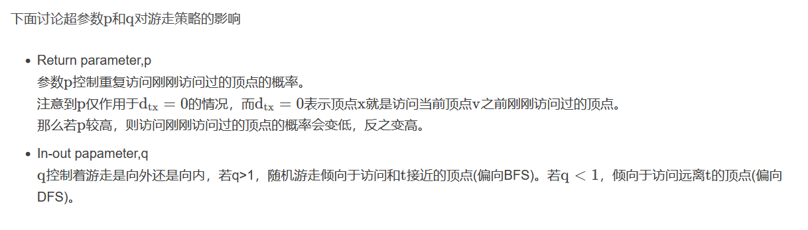

# Graph embedding 

# random walk
>随机游走算法的基本思想是:
>从一个或一系列顶点开始遍历一张图。在任意一个顶点，遍历者将以概率1-a游走到这个顶点的邻居顶点，以概率a随机跳跃到图中的任何一个顶点，称a为跳转发生概率，
>每次游走后得出一个概率分布，该概率分布刻画了图中每一个顶点被访问到的概率。用这个概率分布作为下一次游走的输入并反复迭代这一过程。
> 当满足一定前提条件时，这个概率分布会趋于收敛。收敛后，即可以得到一个平稳的概率分布。

# DeepWalk

>Deepwalk是一种将随机游走(random walk)和word2vec两种算法相结合的图结构数据挖掘算法。该算法能够学习网络的隐藏信息，能够将图中的节点表示为一个包含潜在信息的向量

# LINE 大规模图中效果好
>一阶相似性：局部的结构信息，一阶相似性定义为两个节点之间的局部成对相似性。对于由边(u,v)链接的节点对，其链接权重w_{uv}用于表示节点u和节点v之间的一阶相似性，
> 如果两个节点之间没有边相连，那么他们的一阶相似性为0 
> 一阶相似度只能用于无向图
> 二阶相似性：节点的邻居。共享邻居的节点可能是相似的。
>  二阶相似度同时适用于有向图和无向图。
[LINE代码及其讲解](https://zhuanlan.zhihu.com/p/56478167)

# node2vec

## 优化目标
>设 $f(u)$ 是将顶点 $u$ 映射为embedding向量的映射函数,对于图中每个顶点 $u$，定义$S(u)$  为通过采样策略 $S$ 采样出的顶点  $u$ 的近邻顶点集合。

- node2vec优化的目标是给定每个顶点条件下，令其近邻顶点出现的概率最大

$$max_f\sum_{u\in V}\log{Pr(N_s(U)|f(u))} \tag{1.1} $$

两个假设:
- 条件独立性：假设给定源顶点下，其近邻顶点出现的概率与近邻集合中其余顶点无关
  $$Pr(N_s(u)|f(u)=\prod_{n_i\in N_s(u)} Pr(n_i|f(u)) \tag{1.2}$$
- 特征空间对称性:一个顶点作为元顶点和作为近邻顶点的时候共享一套embedding向量。因此我们条件改了公式可以表示为 
  $$ Pr(n_i|f(u)) = {e^{f(n_i)\times f(u)}\over \sum_{v\in V}e^f(v)\times f(u)} $$

## 采样策略 
>有偏向的随机游走
- 给定当前顶点$v$ ，访问下一个顶点$x$的概率为：
 $$P(c_i=x|c_{i-1}=v)= \begin{cases}
    \pi_{vx}\over Z&\text{if(v,x) \\in E} \\0 &\text{otherwise}
 \end{cases}$$

  > $\pi_{vx}$代表顶点v和顶点x之间的未归一化概率，Z是归一化常数。

 - node2vec引入两个超参数p和q来控制随机游走测录，假设当前经过随机游走经过边$(t,v)$到达顶点v

-   则可以设$\pi_{vx}=\alpha_{pq}(t,x)\times W_{vx}$  其中   $W_{vx}$代表顶点v和x之间的边权。  
$$\alpha_{pq}(t,x)=\begin{cases} 1\over p &\text{if d=0}\\ 1 &\text{if d=1}
\\1\over p&\text{if d=2}
\end{cases}$$

>d为顶点之间最短路径距离

