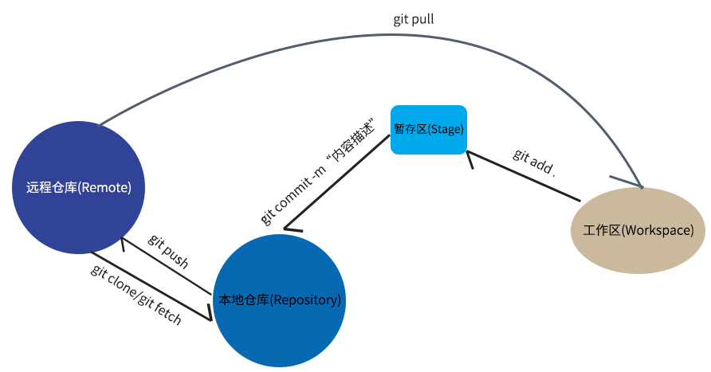
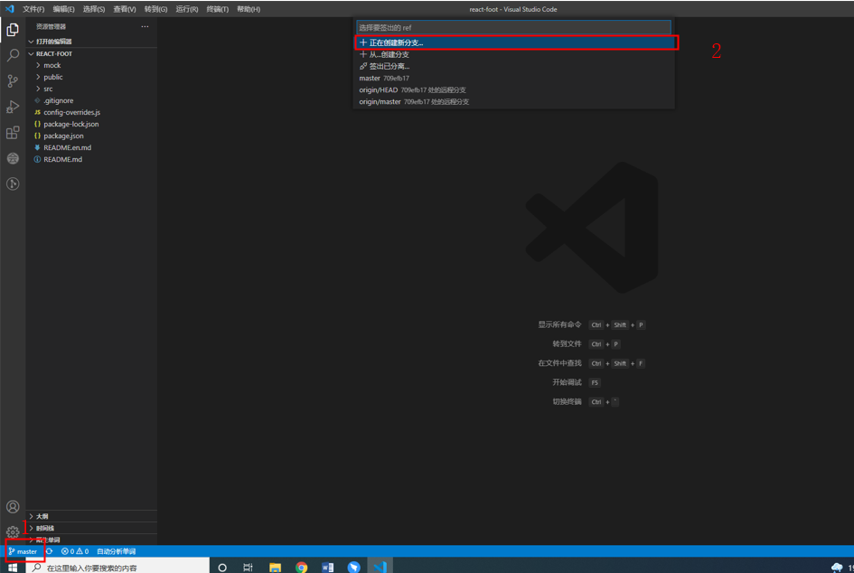
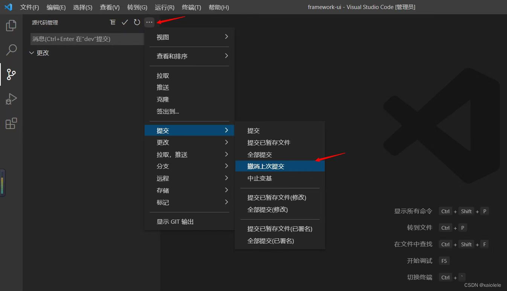
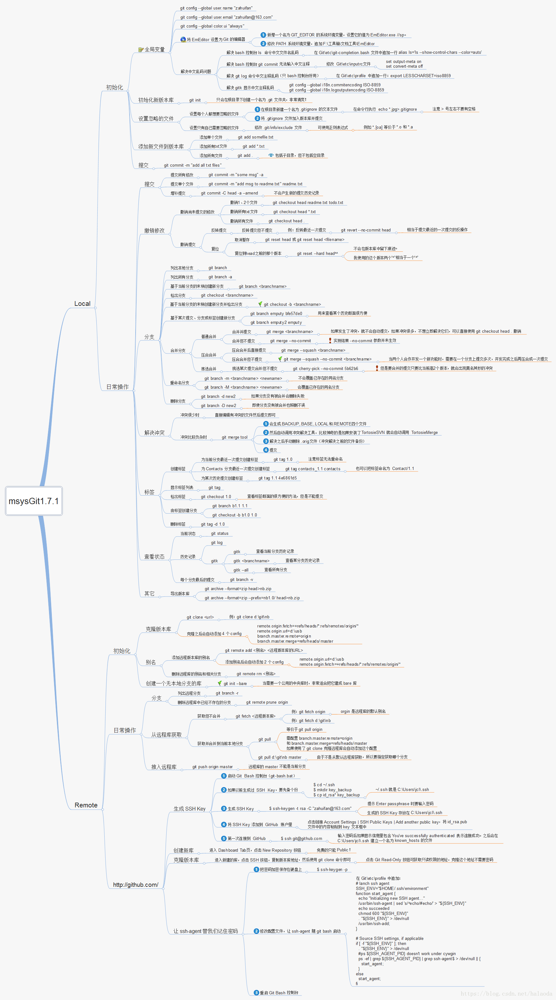

# 本周总结

## 本周学习

- 掌握git指令的学习方法。
- 掌握vscode中git指令的使用方法。


## 知识点总结   

### git是什么？
  Git（读音为/gɪt/）是一个开源的分布式版本控制系统，可以有效、高速地处理从很小到非常大的项目版本管理。 [1]  也是Linus Torvalds为了帮助管理Linux内核开发而开发的一个开放源码的版本控制软件。
### git的四个区域
  - 工作区：处理工作的区域。
  - 暂存区：已完成的工作临时存放区域，等待被提交。
  - 本地仓库：存放数据的地方，但是还在本电脑上，若电脑存储空间损坏还是会造成代码消失。
  - git远程仓库：最终的存放区域，远程服务器。
### git的四个状态
  - 未跟踪：文件没有加入到git库中，不参与版本控制，使用git add变为暂存
  - 已暂存：表示对已修改文件的当前版本做了标记，使之包含在下次提交的列表
  - 已修改：表示修改了文件，但还没将修改的结果放到暂存区
  - 已提交：表示文件已经安全地保存在本地Git仓库
### 逻辑关系表示
  
  
### git 初始化及配置指令
|指令|用途|vscode中使用方法|
|---|---|---|
|git clone|从服务器中下载代码库至指定文件夹|Ctrl+Shift+P 打开后输入|
|git config|配置开发者用户名和邮箱|Ctrl+Shift+P 打开后输入|
|git log|查看版本提交记录|extension中安装Git history和Gitlens后 鼠标点击停留即可|
|git init|初始化一个Git版本库|Ctrl+Shift+P 打开后输入|
### git常用命令及其在vscode中的简单使用


|指令|用途|vscode中的简单使用|
|---|---|---|
|git branch|查看本地所有分支|vscode 左下角分支 
|git status|查看当前状态|资源管理器界面直接观察|
|git commit|提交|源代码管理中的提交按钮|
|git branch -r|查看远程分支|同步后查看即可|
|git checkout -b/null|创建并切换分支/切换分支|点击左下角分支键 选择所进行操作即可|
|git add|暂存缓冲区|点击源代码管理中 更改文件右侧的“＋”|
|git commit null/-m|提交当前respos的所有改变/附带备注信息|点击源代码管理中 更改文件上测的提交键，并输入message|
|git push (远程仓库名) (分支名)|将本地分支推送到服务器上去|提交完后点击同步更新|
|git pull|拉取服务器最新代码|提交完后点击同步更新|
|git merge|合并分支，被合并分支代码不变|左键分支符号 选择合并分支选项|
|git reset --hard (版本号)|回退指定版本|

### git 命令图表和可能遇见的问题及其解决方式



### markdown 语法规则

#### 一， 标题 	

要创建标题，请在单词或短语前面添加井号 (`#`) 。`#` 的数量代表了标题的级别。例如，添加三个 `#` 表示创建一个三级标题。 其中需要注意`#`后有空格。

<table class="table table-bordered">
    <thead class="thead-light">
        <tr>
            <th>Markdown语法</th>
            <th>预览效果</th>
        </tr>
    </thead>
    <tbody>
        <tr>
            <td><code class="highlighter-rouge"># 示例 1</code></td>
            <td>
                <h1 data-toc-skip="" class="no-anchor">示例 1</h1>
            </td>
        </tr>
        <tr>
            <td><code class="highlighter-rouge">## 示例 2</code></td>
            <td>
                <h2 data-toc-skip="" class="no-anchor">示例 2</h2>
            </td>
        </tr>
        <tr>
            <td><code class="highlighter-rouge">### 示例 3</code></td>
            <td>
                <h3 data-toc-skip="" class="no-anchor">示例 3</h3>
            </td>
        </tr>
        <tr>
            <td><code class="highlighter-rouge">#### 示例 4</code></td>
            <td>
                <h4 class="no-anchor">示例 4</h4>
            </td>
        </tr>
        <tr>
            <td><code class="highlighter-rouge">##### 示例 5</code></td>
            <td>
                <h5 class="no-anchor">示例 5</h5>
            </td>
        </tr>
        <tr>
            <td><code class="highlighter-rouge">###### 示例 6</code></td>
            <td>
                <h6 class="no-anchor">示例 6</h6>
            </td>
        </tr>
    </tbody>
</table>

#### 二，换行

在行末尾添加两个以上的空格后回车即可。   
#### 三，字号及颜色
语法规则：
```
<font size=1>大小为1的字体</font>
<font size=6>大小为6的字体</font>    
<font color=gray size=4>gray颜色的字</font>
<font color=green size=4>green颜色的字</font>
<font color=hotpink size=4>hotpink颜色的字</font>
<font color=LightCoral size=4>LightCoral颜色的字</font>
<font color=LightSlateGray size=4>LightSlateGray颜色的字</font>
<font color=orangered size=4>orangered颜色的字</font>
<font color=red size=4>red颜色的字</font>
<font color=springgreen size=4>springgreen颜色的字</font>
<font color=Turquoise size=4>Turquoise颜色的字</font>
```
演示效果如下
><font size=1>大小为1的字体</font>  
><font size=6>大小为6的字体</font>  
><font color=gray size=4>gray颜色的字</font>  
><font color=green size=4>green颜色的字</font>  
><font color=hotpink size=4>hotpink颜色的字</font>  
><font color=LightCoral size=4>LightCoral颜色的字</font>  
><font color=LightSlateGray size=4>LightSlateGray颜色的字</font>  
><font color=orangered size=4>orangered颜色的字</font>  
><font color=red size=4>red颜色的字</font>  
><font color=springgreen size=4>springgreen颜色的字</font>  
><font color=Turquoise size=4>Turquoise颜色的字</font>


#### 分隔线、删除线、下划线

`分割线***`  
`~~我有删除线~~    `  
`我没删除线`  
`<u>我带下划线</u>  `  

演示效果如下
***  
~~我有删除线~~    
我没删除线  
<u>我带下划线</u>  

#### markdown列表

##### 有序列表
`1. 第一列`  
`2. 第二列`  
`3. 第三列`  

预览效果：
1. 第一列
2. 第二列
3. 第三列
   

##### 无序列表

`+ 无序列表`  
`* 无序列表`  
`- 无序列表`

预览效果：
- 无序列表
* 无序列表
+ 无序列表

#### 区块
```
嵌套的格式都是，在使用完上面的一种格式之后，按回车键，然后再按 “Tab” 键即可生成；“Tab” 键具体按几下根据你嵌套的层次自己决定；

第一种：引用嵌套
>第一层嵌套
>>第二层嵌套
>>>第三层嵌套  

第二种：有序列表嵌套
1. 第一列
	1. 第一列的第一列
	2. 第一列的第二列
2. 第二列

第三种：无序列表的嵌套
- 无序列表 1
	- 无序列表 1 的无序列表 1
	- 无序列表 1 的无序列表 2
- 无序列表 2

```
第一种：引用嵌套
>第一层嵌套
>>第二层嵌套
>>>第三层嵌套    


第二种：有序列表嵌套
1. 第一列
	1. 第一列的第一列
	2. 第一列的第二列
2. 第二列


第三种：无序列表的嵌套
- 无序列表 1
	- 无序列表 1 的无序列表 1
	- 无序列表 1 的无序列表 2
- 无序列表 2


## 问题总结

### vscode 
- 错误日志
```
  报错“无法推送refs到远端，您可以试着运行“拉取”功能，整合您的更改。” 
```

- 错误分析
  - 该冲突源于同一个项目放到不同的文件下面。在未拉取代码的情况下对文件进行修改。
- 解决方法
  - 在推送之前进行拉取即可。
- 参考资料
  - [解决无法推送问题](http://t.csdn.cn/ezuuW)

## 感悟

- 不管是git指令的学习还是MD使用方法的学习都让我觉出来，我个人所掌握的知识仅仅是九牛一毛。
