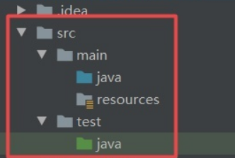
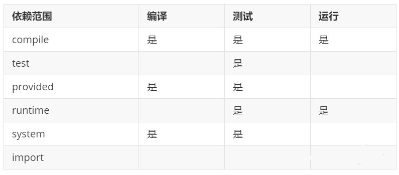

# 本周总结

## 本周学习

- 安装MySQL
- 在IDEA中配置Maven
- 熟悉SQL基本指令
- 掌握Maven基本操作
----
## 知识点总结(MySQL部分)

### 关于SQL 

- SQL概述

  ```
  Structure Query Language(结构化查询语言)简称SQL。数据库管理系统可以通过SQL管理数据库；定义和操作数据，维护数据的完整性和安全性。

  ```

- SQL的分类
  
  - DDL(Data Definition Language) 数据定义语言，用来操作数据库、表、列等； 常用语句：CREATE、 ALTER、DROP
  - DML(Data Manipulation Language) 数据操作语言，用来操作数据库中表里的数据；常用语句：INSERT、 UPDATE、 DELETE
  - DCL(Data Control Language) 数据控制语言，用来操作访问权限和安全级别； 常用语句：GRANT、DENY
  - DQL(Data Query Language) 数据查询语言，用来查询数据 常用语句：SELECT   
  
### 数据库的三大范式
- 三大范式的关系
  - 第一范式(1NF)是指数据库表的每一列都是不可分割的基本数据线；也就是说：每列的值具有原子性，不可再分割。
  - 第二范式(2NF)是在第一范式(1NF)的基础上建立起来得，满足第二范式(2NF)必须先满足第一范式(1NF)。如果表是单主键，那么主键以外的列必须完全依赖于主键；如果表是复合主键，那么主键以外的列必须完全依赖于主键，不能仅依赖主键的一部分。
  - 第三范式(3NF)是在第二范式的基础上建立起来的，即满足第三范式必须要先满足第二范式。第三范式(3NF)要求：表中的非主键列必须和主键直接相关而不能间接相关；也就是说：非主键列之间不能相关依赖。
  
### 数据库的数据类型
>   使用不同的数据类型决定了MySQL中的存储方式不同。为此，MySQL数据库提供了多种数据类型，其中包括
 <font color=red size=4>整数类型、浮点数类型、定点数类型</font>  

- 整数类型  

|数据类型|字节数|无符号数的取值范围|有符号数的取值范围|  
|:---:|:---:|:---:|:---:|
|TINYINT|1|0~244|-128~127|
|SMALLINT|2|0~65535|-32768~32768|
|MEDIUMINT|3|0~16777215|-8388608~8388608|
|INT|4|0~4294967295|-2147483648~ 2147483648|
|BIGINT|8|0~18446744073709551615|-9223372036854775808~9223372036854775808|

- 浮点数类型和定点数
>在MySQL数据库中使用<font color= green size=4>浮点数和定点数</font>来存储小数。浮点数的类型有两种：单精度浮点数类型（FLOAT)和双精度浮点数类型（DOUBLE)。而定点数类型只有一种即DECIMAL类型。下图列举了 MySQL中浮点数和定点数类型所对应的字节大小及其取值范围。

|数据类型|字节数|无符号数的取值范围|有符号数的取值范围|  
|:---:|:---:|:---:|:---:|
|FLOAT|4|-3.402823466E+38~-1.175494351E-38|0和1.175494351E-38~3.402823466E+38|
|DOUBLE|8|-1.7976931348623157E+308~2.2250738585072014E-308|0和2.2250738585072014E-308~1.7976931348623157E+308|
|DIECIMAL(M,D)|M+2|-1.7976931348623157E+308~2.2250738585072014E-308|0和2.2250738585072014E-308~1.7976931348623157E+308|

- 字符串类型
>  在MySQL中常用CHAR和VARCHAR表示字符串。两者不同的是：VARCHAR存储可边长的字符串。  
> <font color= yellow >当数据为CHAR(M)类型时，无论插入值的长度实际是多少，它所占的存储空间都是M个字节;而VARCHAR(M)所对应的数据所占用的字节数为实际长度加1</font>

|插入值|CHAR(3)|存储需求|VARCHAR(3)|存储需求|
|:---:|:---:|:---:|:---:|:---:|
|''|''|3个字节|''|1个字节|
|'a'|'a'|3个字节|'a'|2个字节|
|'ab'|'ab'|3个字节|'ab'|3个字节|
|'abc'|'ab|3个字节|'abc'|4个字节|

- 文本类型
>文本类型用于表示大文本数据，例如“文章内容、评论、详情等，它的类型分为以下四种：

|数据类型|存储范围|
|:---:|:---:|
|TINYTEXT|0~255字节|
|TEXT|0~65535字节|
|MEDIUMTEXT|0~16777215字节|
|LONGTEXT|0~4294967295字节|

- 日期与时间类型
> MySQL提供的表示日期和时间的数据类型分别时：YEAR、DATE、TIME、DATETIME 和 TIMESTAMP。

|数据类型|字节数|取值范围|日期格式|零值|
|:---:|:---:|:---:|:---:|:---:|
|YEAR|1|1901~2155|YYYY|0000|
|DATE|4|1000-01-01~9999-12-31|YYY-MM-DD|0000-00-00|
|TIME|3|-838：59：59~ 838：59：59|HH:MM:SS:00:00:00|
|DATETIME|8|1000-01-01 00:00:00~9999-12-31 23:59:59|YYYY-MM-DD HH:MM:SS|0000-00-00 00:00:00|
|TIMESTAMP|4|1970-01-01 00:00:01~2038-01-19 03:14:07|YYYY-MM-DD HH:MM:SS|0000-00-00 00:00:00|

> - YEAR类型
>   - YEAR类型用于表示年份，在MySQL中，可以使用以下三种格式指定YEAR类型的值：
>       - 使用4位字符串或数字表示，范围为‘1901’-‘2155’或1901-2155.
>       - 使用2位字符串表示，范围为‘00’--‘99’。其中，‘00’--‘69’会被转换为2001--2069范围的YEAR值。‘70’--‘99’会被转换为1970--1999的范围的YEAR值。
>       - 使用2位数字表示，范围为‘1’--‘99’。 1-69范围的值会被转换为2001--2069范围的YEAR值，70--99会被转换为1970-1999范围的YEAR值。


> - TIME类型
>   - TIME类型用于表示时间的值，它的显示形式一般为HH:MM:SS，其中，HH表示小时,MM表示分，SS表示秒。在MySQL中可以用以下三种格式指定TIME的值：
>       - 以‘D HH:MM:SS’字符串格式表示。其中D表示日，可取0--34之间的值，插入数据时，小时的值等于（DX24+HH)
>       - 以’HHMMSS’字符串格式或者HHMMSS数字格式表示。
>       - 使用CURRENT_TIME或NOW()输人当前系统时间。

>- DATETIME类型
>   -  DATETIME类型用于表示日期和时间，它的显示形式为’YYYY-MM-DD HH: MM:SS’，其中，YYYY表示年，MM表示月，DD表示日，HH表示小时，MM表示分，SS 表示秒。在MySQL中，可以使用以下3种格式指定DATETIME类型的值。
>       - 1、以’YY-MM-DD HH:MM:SS’或者’YYMMDDHHMMSS’字符串格式表示的日期和时间，其中YY表示年，取值范围为’00’—‘99’。与DATE类型中的YY相同，‘00’— '69’范围的值会被转换为2000—2069范围的值，‘70’—'99’范围的值会被转换为1970—1999范围的值。
>        - 以YYYYMMDDHHMMSS或者YYMMDDHHMMSS数字格式表示的日期 和时间。例如，插入20190122090123或者190122090123,插人数据库中的DATETIME值都 为 2019-01-22 09:01:23。
>       - 使用NOW来输人当前系统的日期和时间。


- 二进制类型
> 在MySQL中常用BLOB存储二进制类型的数据，例如：图片、PDF文档等。BLOB类型分为如下四种：

|数据类型|存储范围|
|:---:|:---:|
|TINYBLOB|0~255字节|
|BLOB|0~65535字节|
|MEDIUMBLOB|0~16777215字节|
|LONGBLOB|0~4294967295字节|


### 数据库操作

|语法|解释|
|---|:---:|
|<font color=purple size=3>creat database  </font> 数据库名称|创建数据库，即在数据可系统中划分一块空间存储数据|
|<font color=purple size=3>show creat database </font> 数据库名称|创建数据库后查看该数据库的基本信息|
|<font color=purple size=3>drop database </font>数据库名称|删除数据可|
|<font color=purple size=3>show databases</font>| 查询MySQL中所有数据库|
|<font color=purple size=3>alter database xxx character set gbk</font>|将xxx数据库的字符集修改为gbk MySQL命令|
|<font color=purple size=3>use</font> 数据库名称|切换数据库|
|<font color=purple size=3>select database()</font>|查看当前数据库|

### 数据表操作
>数据库创建成功后可在该数据库中创建数据表(简称为表)存储数据。

- 创建数据表
``` java
    create table 表名(
         字段1 字段类型,
         字段2 字段类型,
         …
         字段n 字段类型
);

例如：
 create table student(
 id int,
 name varchar(20),
 gender varchar(10),
 birthday date
 );

```
- 查看数据表基本操作
  
|语法|解释|
|---|:---:|
|<font color=purple size=3>show tables</font>|查看当前数据库的所有表|
|<font color=purple size=3>show creat table </font>表名称|查看表的基本信息|
|<font color=purple size=3>desc  </font>表名称|查看表的字段信息|
   
- 修改删除数据表
  
|语法|解释|例子|
|---|:---:|:---:|
|<font color=purple size=3>alter table  </font> 原表名称 <font color=purple size=3>rename to  </font>新表名称| 修改表名|alter table student rename to stu;|
|<font color=purple size=3>alter table  </font> 表名称<font color=purple size=3>change  </font>原字段名 新字段名  字段数据类型|修改字段名|alter table stu change name sname varchar(10);|
|<font color=purple size=3>alter table   </font> 表名称  <font color=purple size=3>modify  </font>字段名称 修改类型|修改字段类型|alter table stu modify sname int;
|<font color=purple size=3>alter table</font> 表名称 <font color=purple size=3>add</font> 新字段名称 字段数据类型|增加字段|alter table stu add address varchar(50);|
|<font color=purple size=3>alter table</font> 表名称 <font color=purple size=3>drop </font> 字段名称 |删除字段|alter table drop address|
|<font color=purple size=3>drop table</font>表名称|删除表|drop table stu;|

### 数据表约束
> 为防止错误数据的插入，MySQL中定义了一些维护数据库完整性的规则。这些规则常被称为表的约束

|约束条件|说明|
|:---:|:---:|
|PRIMARY KEY|主键约束用于唯一表示对应的记录|
|FOREIGN KEY|外键约束|
|NOT NULL|非空约束|
|UNIQUE|唯一性约束|
|DEFAULT|默认值约束，用于设置字段的默认值|
此物质与约束条件针对表中字段进行限制从而保证表中数据的正确性唯一性。
实际上表的约束条件就是对于表中数据的限制条件

#### 五种约束条件的解释
- 主键约束
  - 主键约束用于唯一的标识表中的的每一行。 被标识为主键的数据在表中是唯一的并且其key值不能为null
  - 语法为:`字段名 数据类型 primary key`
  - 主键约束设置的两种方式分别为：
    - ```creat table student( id int primary key,name varchar(20));``` 
    - ```create table student01(id int name varchar(20)primary key(id));```

- 非空约束
  - 非空约束即 NOT NULL，代表字段值不能为空。
  - 语法为```字段名 数据类型 NOT NULL;```
  - 例：```creat table student02(id int,name varchar(20) not null);```
- 默认值约束
  - 默认值约束即DEFAULT用于给数据表中的字段指定默认值，即当前在表中插入新记录时，数据库默认给这个字段插入默认值。
  - 语法：```字段名 数据类型 DEFAULT 默认值;```
  - 例:```creat table student03(id int,name varchar(20),gender varchar(10) default 'male');```
- 唯一性约束
  - UNIQE用于保障数据表中字段的唯一性
  - 语法：```字段名 数据类型 UNIQUE;```
  - 例：``` creat table student04(id int, name varchar(20) unique);```
- 外键约束
  - 外键约束即FOREIGN KEY用于多表之间
  - 语法：```-创建数据表时语法为：CONSTARIT 外键名FOREIGN KEY（从表外键字段）　REFERENCES 主表（主键字段)```
  - ```创建数据表后　语法为:ALTER TABLE　从表名　ADD CONSTRAINT 外键名　FOREIGN KEY(从表外键字段)　REFERENCE 主表（主键字段）```
  - 例：``` creat table student05(id int primary key, name varchar(20)); creat table class(classid int primary key, studentid int);```
  - ```alter table class add constraint fk_class_studentid foreign key(studentid) references student05(id);```

  - 若主表数据被删除或修改，从表中对应的数据也应该被删除，否则数据库中会很冗杂。
    - 语法```alter table 从表名 drop foreign key 外键名```
    - 例如：``` alter table class drop foreign key fk_class_studentid;```

### 数据表中插入数据
>先准备一个数据表``` creat table student(id int,name varchar(30),age int,gender varchar(30));```

|语法|解释|例子|
|:---:|:---:|:---:|
|<font color=purple size=3>INSERT INTO </font> 表名(字段1，字段2，，，，)<font color=purple size=3> VALUES </font>(值1，值2，...);|插入一条字段信息|```insert into student (id,name,age,gender) values (1,'bob',16,'male');```|
|<font color=purple size=3>INSERT INTO </font>表名（字段名1，字段2，...) <font color=purple size=3> VALUES </font> (值1，值2,....);|为指定字段插入数据|```insert into student (id,name,age,gender) values (1,'bob',16,'male');```|
|<font color=purple size=3>INSERT INTO </font> 表名[(字段名1，字段2，...)] <font color=purple size=3> VALUES </font> (值1，值2,....),(值1，值2，....),..;|同时插入多条记录|```insert into student (id,name,age,gender) values (2,'lucy',17,'female'),(3,'jack',19,'male'),(4,'tom',18,'male');```


### 更新数据
>通过UPDATE语句更新数据表中的数据。student学生表。
- UPDATE基本语法
  - UPDATE 表名 SET 字段名1=值1[，字段名2=值2，...][WHERE 条件表达]
  - 例如：```update student set age=20,gender='female' where name='tom';```将name为tom的记录的age设置为20并将其gender设置为female 
  - 更新全部数据```update student set age=18```

### 删除数据
>先创建一张数据表
``` java
create table student(id int, name varchar(30),age int,
gender varchar(30));insert into student (id,name,age,gender) values (2,'lucy',17,'female'),(3,'jack',19,'male'),(4,'tom',18,'male'),(5,'sal',19,'female'),(6,'sun',20,'male'),(7,'sad',13,'female'),(8,'sam',14,'male');
```
- delete基本语法
  - <font color=purple size=3>DELETE FROM </font> 表名[where 条件表达式]
  - 删除部分数据例子：
    - ``` delete from student where age=14``` 
    - 删除所有14岁的学生
  - 删除全部数据
    - ```delete from student```
- TRUNCATE 和 DELETE的区别
  - TRUNCATE和DETELE都能实现删除表中的所有数据的功能，但两者也是有区别的：
    - DELETE语句后可跟WHERE子句，可通过指定WHERE子句中的条件表达式只删除满足条件的部分记录；但是，TRUNCATE语句只能用于删除表中的所有记录
    - 使用TRUNCATE语句删除表中的数据后，再次向表中添加记录时自动增加字段的默认初始值重新由1开始；使用DELETE语句删除表中所有记录后，再次向表中添加记录时自动增加字段的值为删除时该字段的最大值加1
    - DELETE语句是DML语句，TRUNCATE语句通常被认为是DDL语句

### 查询数据
#### 两种最常用的查询
- ```select * from student;``` 查询所有字段
- ```select sid,sname from student;``` 查询指定字段
这里不再juli
#### 常数的查询
- ```select sid,sname,'2021-03-02' from student;```

#### 从查询结果中过滤重复(特定)数据（distinct and or)
- ```select distincr gender  from student```注意在SELECT查询语句中DISTINCT关键字只能用在第一个所查列名之前。
- 可以加一个算术运算符``` select sname,age+10 from student;```
- 用AND连接两个查询条件```select * from student where age>15 and gender='male';```
- or 连接```select * from student where age>15 or gender='male';```

#### 使用LIKE关键字查询
>MySQL中可使用LIKE关键字可以判断两个字符串是否相匹配

- 普通字符串
  - ```select * from student where sname like 'wang';```
- 含有%通配的字符串
  - ```select * from student where sname like 'li%' ;```
  - %用于匹配任意长度的字符串。例如，字符串“a%”匹配以字符a开始任意长度的字符串
-  含有_通配的字符串
   -  下划线通配符只匹配单个字符，如果要匹配多个字符，需要连续使用多个下划线通配符。例如，字符串“ab_”匹配以字符串“ab”开始长度为3的字符串，如abc、abp等等；字符串“a__d”匹配在字符“a”和“d”之间包含两个字符的字符串，如"abcd"、"atud"等等。
   -  ```select * from student where sname like 'zx__';```
- 使用LIMIT限制查询结果的数量
  - ```select * from student order by age asc limit 3;```
  - 查询学生表中年纪最小的3位同学 
  #### 使用GROUP BY进行分组查询
- GROUP BY对数据进行分组再进行查询等操作。
  - GROUP BY和聚合函数一起使用
      - ```select count(*), departmentnumber from employee group by departmentnumber;```统计各部门员工数量。
      - ```select count(*), departmentnumber from employee where departmentnumber>1001 group by departmentnumber;```统计部门编号大于1001的各部门员工数量
    - GROUP BY和聚合函数以及HAVING一起使用
      - ```select sum(salary),departmentnumber from employee group by departmentnumber having sum(salary)>8000;```统计工资综合大于800的部门


#### 使用ORDER BY对查询结果排序
从表中査询出来的数据可能是无序的或者其排列顺序不是我们期望的。为此，我们可以使用ORDER BY对查询结果进行排序
- 语法：```SELECT 字段名1,字段名2,…
FROM 表名
ORDER BY 字段名1 [ASC 丨 DESC],字段名2 [ASC | DESC];```

  - ```select * from student order by age asc;```查询所有学生并且按照年纪大小升序排列
  - ```select * from student order by age dasc;```查询所有学生并且按照年纪大小降序序排列


### 别名设置
#### 表别名
>在査询数据时可为表和字段取別名，该别名代替表和字段的原名参与查询操作。
- 语法：```SELECT * FROM 表名 [AS] 表的别名 WHERE .... ;```
- 例子``` select * from student as stu;;```

#### 字段别名
>在查询操作时，假若字段名很长使用起来就不太方便，此时可该字段取一个別名，用该别名来代替字段的名称
- ```SELECT 字段名1 [AS] 别名1 , 字段名2 [AS] 别名2 , ... FROM表名 WHERE ... ;```
- ```select name as '姓名',id from student;```


-----

## 知识点总结(maven部分)

### maven介绍
  - maven是一个项目构建工具，类似于makefile之于c++程序。虽然maven大多用于Java项目，但是maven并没有指定特定语言。
  - maven中的pom是描述性和声明性的。它不像makefile一样提供显示的指令，而是指定项目总体信息、构建设置、构建环境、pom之间的关系（结成父项目的pom）
  
### 为什么用maven?
#### 1,解决jar包获取难、每个项目独立一份、包依赖问题和jar包的冲突问题
- 实际上，jar包之间不是孤立存在的同样需要其他jar包的支持才能用。这就是我们常说的jar包之间的依赖关系。如果用到一个jar包就要把他依赖的所有jar包都导入。
  
#### 2,处理jar包之间的冲突
- 什么导致了jar包之间的冲突
>jar包冲突就是当有依赖关系的几个jar包中，都依赖了相同的jar包但是jar包的版本不一样，此时就造成了jar包冲突。

- 解决jar包冲突的两大原则
><font color=red size=3>最短路径者优先和先声明者优先 </font> 
 
  举个例子：
>我们现在有三个工程MakeFriend、Hello和HelloFriend。  
>MakeFriend依赖HelloFriend，HelloFriend依赖Hello。  
而Hello依赖log4j.1.2.17.jar，HelloFriend依赖log4j.1.2.14.jar。


>那么当MakeFriend工程的运行时环境中该导入log4j.1.2.14.jar呢还是log4j.1.2.17.jar呢？  
实际上maven是可以自动处理jar包之间的冲突问题。  
因为Maven中内置了两条依赖原则：<font color=red size=3>最短路径者优先和先声明者优先 </font>，上述问题的MakeFriend工程则会根据Maven依赖原则自动使用log4j.1.2.14.jar


#### 3,将项目拆分成多个工程模块
>现在一个JavaEE项目的规模越来越庞大，开发团队人员也越来越对。我们想象一下，当成百上千人开发同一个项目时。那么架构师、项目经理该如何划分项目的模块、如何分工呢？这时候的项目已经不可能再通过package结构来划分模块。多个模块工程中有的是Java工程，有的是Web工程。

>当工程拆分后又如何进行互相调用和访问呢？这就需要用到Maven的依赖管理机制：上层模块依赖下层，所以下层模块中定义的API都可以为上层所调用和访问。
#### 4，实现项目的分布式部署

>在实际生产环境中，项目规模增加到一定程度后，可能每个模块都需要运行在独立的服务器上，我们称之为分布式部署，这里同样需要用到Maven。


### 如何构建一个maven项目？
- 构建的概念：构建并不是创建，是将我们编写的java代码、配置文件、jsp页面和图片等一些静态资源作为原材料，经过一定的步骤去生成一个可以运行的项目的过程。
- 构建的步骤：
  - 清理 clean：删除之前的编译结果（target文件夹）
  -  编译 compile：将Java源程序编译为字节码文件。
  - 测试 test：针对项目中的关键点进行测试，确保项目在迭代开发过程中关键点的正确性。
  - 报告 report：在每一次测试后以标准的格式记录和展示测试结果。
  - 打包 package：将一个包含诸多文件的工程封装为一个压缩文件用于安装或部署。Java工程对应jar包，Web工程对应war包。
  - 安装 install：在Maven环境下特指将打包的结果——jar包或war包安装到本地仓库中。
  - 部署：将打包的结果部署到远程仓库或将war包部署到服务器上运行。


>

### maven的核心概念

  Maven的核心概念包括：POM、约定的目录结构、坐标、依赖、仓库、声明周期、插件和目标、继承、聚合。

  - POM Project Object Model: 项目对象模型。将java工程的相关信息封装为对象作为便于管理和操作的模型。
    - 也是maven工程的核心配置，可以说学习Maven就是学习opm.xml文件中的配置。  
     
  - 约定的目录结构
    - 约定>配置>编码  
  意思就是能用配置解决的问题就不编码，能基于约定的就不进行配置。  
  

  - 坐标
    - maven通过三个向量来确定一个maven工程
      - groupld:公司或组织的域名倒序+当前项目名称
      - artifactId：当前项目的模块名称
      - version：当前模块的版本

><dependencies>
     <!--坐标-->
     <dependency>
         <groupId>maven</groupId>
         <artifactId>Hello</artifactId>
         <version>1.0-SNAPSHOT</version>
     </dependency>
     
     <dependency>
         <groupId>junit</groupId>
         <artifactId>junit</artifactId>
         <version>4.0</version>
         <scope>test</scope>
     </dependency>
 </dependencies>
 


- 依赖关系  
    - 概念：当Ajar包中需要用到Bjar包中的类时，就是A对B有依赖。
    - 依赖关系的导入：使用dependency标签指定目标jar包的坐标。
    
  
    - 直接依赖和间接依赖：如果A依赖B，B依赖C，那么A→B和B→C都是直接依赖，而A→C是间接依赖。
  
- 依赖范围
  - compile(默认是这个范围)
    - main目录下的Java代码可以访问这个范围的依赖
    -  test目录下的Java代码可以访问这个范围的依赖
    -  部署到Tomcat服务器上运行时要放在WEB-INF的lib目录下
  - test
    - main目录下的Java代码不能访问这个范围的依赖

    -   test目录下的Java代码可以访问这个范围的依赖

    - 部署到Tomcat服务器上运行时不会放在WEB-INF的lib目录下

    - 例如：对junit的依赖。仅仅是测试程序部分需要。
  - provided
    - main目录下的Java代码可以访问这个范围的依赖
    - test目录下的Java代码可以访问这个范围的依赖
    - 部署到Tomcat服务器上运行时不会放在WEB-INF的lib目录下
    - 例如：servlet-api在服务器上运行时，Servlet容器会提供相关API，所以部署的时候不需要。


注意   
- 依赖的传递性:只有依赖范围是compile时才具有依赖传递性。
- 依赖的原则：最短路径者优先和先声明者优先。
- 依赖的排除：当自身与所依赖的jar包都依赖的相同的jar包但是版本不同，可以通过依赖排除间接依赖。

``` java
<dependency>
     <groupId>maven</groupId>
     <artifactId>OurFriends</artifactId>
     <version>1.0-SNAPSHOT</version>
 ​
     <!--依赖排除-->
     <exclusions>
         <exclusion>
             <groupId>commons-logging</groupId>
             <artifactId>commons-logging</artifactId>
         </exclusion>
     </exclusions>
 </dependency>
 ​
 <dependency>
     <groupId>commons-logging</groupId>
     <artifactId>commons-logging</artifactId>
     <version>1.1.2</version>
 </dependency>
```

### 统一管理jar包版本
>当使用同一jar包的不同子jar时，可以对jar包版本做统一配置，这样在后期改动时比较方便。  
例如：
``` java
<properties>
     <spring.version>4.0.0.RELEASE</spring.version>
 </properties>
 <dependency>
     <groupId>org.springframework</groupId>
     <artifactId>spring-context</artifactId>
     <version>${spring.version}</version>
 </dependency>
 <dependency>
     <groupId>org.springframework</groupId>
     <artifactId>spring-webmvc</artifactId>
     <version>${spring.version}</version>
 </dependency>
 <dependency>
     <groupId>org.springframework
```

### 仓库
- 本地仓库:为当前本机电脑上的所有maven工程服务。
- 远程仓库：
  - 中央仓库：架设在Internet上，为世界所有的maven工程服务。
  - 中央仓库的镜像：架设在各个大洲，为中央仓库分担流量。减轻中央仓库的压力，同时更快的响应用户需求。
  - 私服：架设在当前局域网环境下，为当前局域网范围内的所有maven工程服务。
  
### 生命周期
Maven有三套相互独立的生命周期，分别是：
- Clean Lifecycle 在真正的构建之前进行一些清理工作。
- Default Lifecycle 构建的核心部分，包括编译、测试、打包、安装、部署等等。
- Site Lifecyclie 生成项目报告，站点，发布站点。

运行任何一个阶段的时候，它前面的所有阶段都会被运行，例如我们运行mvn install的时候，代码会被编译，测试，打包。这就是maven的生命周期的，因此理解生命周期至关重要。

### 插件与目标
- maven的核心仅仅定义了抽象的生命周期，具体任务都是交由插件完成的。
- 每个插件都能实现多个功能，每个功能就是一个插件目标。
- maven的生命周期与插件目标相互绑定，已完成某个具体任务的构建。
- 例:compile 就是插件maven-compuler-plugin的一个功能;pre-clean是插件maven-clean-plugin的一个目标。
  
### 继承
>使用继承机制就可以将这样的依赖信息统一提取到父工程模块中统一管理。
父工程：
``` java
<groupId>com.atguigu.maven</groupId>
 <artifactId>Parent</artifactId>
 <packaging>pom</packaging>
 <version>1.0-SNAPSHOT</version>
 <!--父工程的打包方式为pom，只需要保留pom.xml文件即可-->
 ​
 <!--依赖管理-->
 <dependencyManagement>
     <dependencies>
         <dependency>
             <groupId>junit</groupId>
             <artifactId>junit</artifactId>
             <version>4.0</version>
             <scope>test</scope>
         </dependency>
     </dependencies>
 </dependencyManagement>

```
子工程：
``` java
<parent>
     <groupId>com.atguigu.maven</groupId>
     <artifactId>Parent</artifactId>
     <version>1.0-SNAPSHOT</version>
 <!--指定从当前pom.xml文件出发寻找父工程的pom.xml文件的相对路径-->
 <relativePath>../Parent/pom.xml</relativePath>
 </parent>
 <!--如果子工程的groupId和version如果和父工程重复则可以删除-->
 ​
 <!--在子项目中重新指定需要的依赖，删除范围和版本号-->
 <dependency>
     <groupId>junit</groupId>
     <artifactId>junit</artifactId>
 </dependency>

```

### 聚合

>使用了聚合之后，可以批量进行maven工程的安装、清理工作。  
>maven 可以根据各个模块的继承和依赖关系自动选择安装的顺序，在总的聚合工程中使用modules/module标签组合，指定模块工程的相对路径。
```
<!--聚合-->
 <modules>
     <module>../MakeFriend</module>
     <module>../OurFriends</module>
     <module>../HelloFriend</module>
     <module>../Hello</module>
 </modules>

```

### DEBUG

- 错误日志(1)

```
 安装完maven，并且更改了阿里云镜像之后，从中央仓库拉去jar包的速度仍然是以几十kb/s运输。
```

- 解决方案

  - 这个事情困扰了我很长时间。在小组成员线上会议讨论的时候。陈柯羽的一段话给了答案。IDEA专业版自带Maven。
  - 所以我们下载并且更改镜像的maven版本实际上，不是IDEA编译器默认的。
  - 在IDEA中的setting中找到maven相关。在此修改maven home path，将其更改为我们所下载的maven3.8.6 的path.
  


- 参考资料

  - [小组线上会议](./meeting_01.mp4)


- 错误日志(2)
  ``` 
  运行select * from student，报错：Error Code: 1046. No database selected Select the default DB to be used by double-clicking its name in the SCHEMAS list in the sidebar.
  ```
- 解决方案
  - 该错误源于未选定特定数据表。
  - 使用```use table ```提前选定数据表即可
  
- 错误日志(3)
  ```
  以quickstart为模板创建web工程，创建的工程文件没有main/src文件。未按照模板出现，符合项目结构的文件夹。
  ```
- 解决方案
  - 实际上出现该问题有多个原因：
  - 个人原因是项目构建的选择有问题
  - 应该从structure 中选定moudle并添加模板quickstart进行创建。
  - 创建完成后会有一定的反应时间，这段时间内虽然会显示已经创建完毕。但是文件夹内没有想要的东西。这时控制台还依然在构建当中。需要等一下。
  - 如果根目录下没有发现新建的项目文件，需要寻找是不是建在了次级目录下。

- 错误日志(4)
  ```
  idea报错：java: 警告: 源发行版 11 需要目标发行版 11
  ```
- 解决方案：
  
  
  
  
  
## 感悟

- 本周的课程相对来说难度较为大一点，所需知识点也比较繁琐
- 不论是maven还是MySQL目前都是比较繁琐的知识。希望自己能够保持积极向上的冲劲，面对未知，敢于挑战。
- 