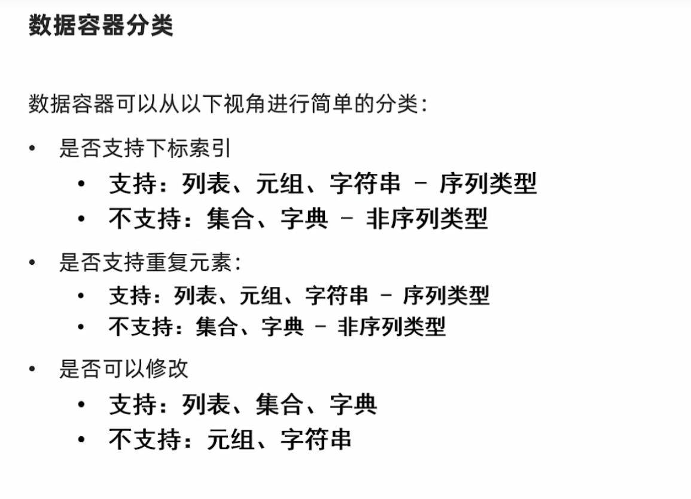
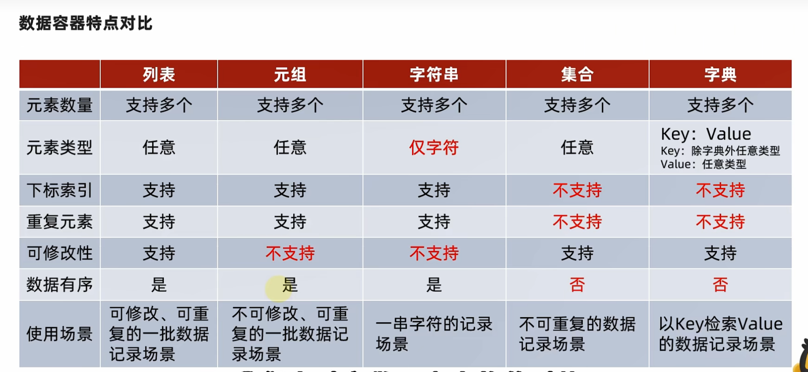
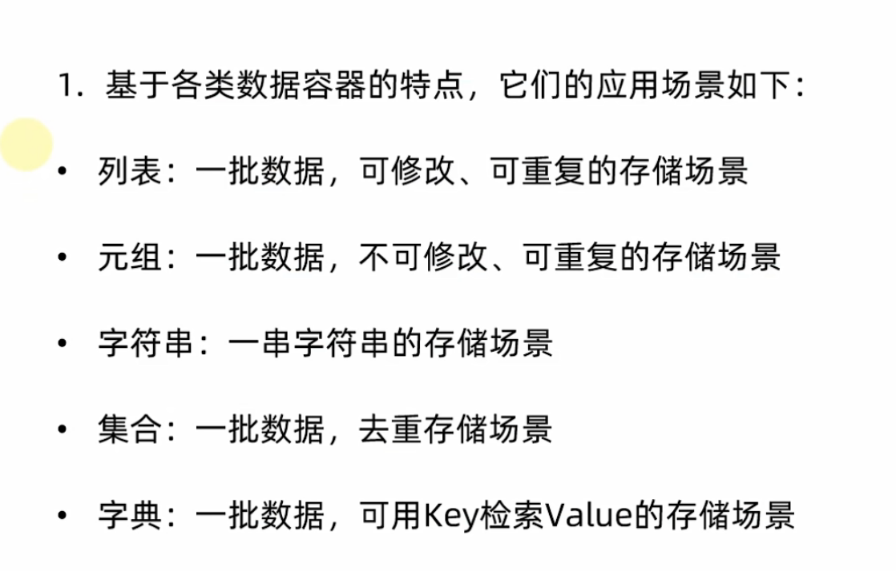

#本周学习
s

##week1学习内容
1. python基本知识
   1. if语句
   2. for循环
   3. while循环
   4. 函数
   5. 文件输入输出
   6. 异常
2. 新知识（相比于Java,C++新增的知识）
   1. 列表
   2. 元组
   3. 字典
   4. 字符串


##python基本知识

###if语句（感觉没啥好说的）
if 判断语句：
    行为语句


###for循环
for 变量名 in 可迭代对象   
动作代码1
动作代码2
动作代码3

```python
#range语句
#range(num)
for x in range(10):
    print(x)
#range(num1,num2){不包含num2}
for x in range(2,5):
    print(x)
#range(num1,num2,step){不包含num2}
for x in range(1,10,2):
    print(x)
```

###while循环
while循环，自我感觉就和其他语言差不多了，以下举个例子吧
从100加到1的总和
``` python
i=1
sum=0
while i<=100:
    sum =sum+i
    i=i+1
print(sum)
```

###函数操作
函数其实也和其他语言差不多，其中函数的多个返回值中有所区别，以我目前的学习进度，感觉在传入参数上真的很方便，可以进行不定长传参
```python
#不定长参数-位置不定长*号
#会作为元组的形式存在，并且不断加入其中
def user(*args):
    print(f"传入的类型为:{type(args)},其内容为{args}")

user(1,2,3,4,"小丘",True)
#会以元组的形式存在


#不定长参数——关键字不定长，**号
def user1(**kwargs):
    print(f"传入的类型为:{type(kwargs)},其内容为{kwargs}")

user1(name="小王",age=12,gender="男")
#会以字典的形式存在
###文件的输入输出
``` 
目前只学会了对‘txt’的文件输入输出，学习对应的函数方法，懂得调用即可

自己跟着视频做的小小小小案例，将文件读取筛选，并进行备份的操作，基本上就都用上了熟悉的函数了
``` python
#文件使用案例,
#打开文件
f=open("D:/python/bill.txt",'r',encoding='UTF-8')
g=open("D:/python/billbeifen.txt",'w',encoding="UTF-8")
i=0
for line in f:
    if i==0:
        g.write(line)
    line=line.strip()
    word=line.split(',')
    if word[-1]=='正式':
        g.write(line+'\n')
    i+=1
g.close()
f.close()
```
###异常
异常的话，其实也和C++有点像 
其中else和finally挺有意思的， 
else是指如果没有出现异常将要执行的语句 
finally是指不论是否出现异常都会运行

```python
#异常的相关写法
try:
    f=open("d:/python/test2.txt",'r',encoding="UTF-8")
except Exception as e:
    print("出现异常了")
    f=open("d:/python/test2.txt",'w',encoding="UTF-8")
else:
    print("没有异常")
finally:
    print("管他有没有异常，我都要执行")
```
##新知识
这是我自己个人感觉在python的新知识，主要是在类的数据容器不熟悉，我就随便乱写了（doge）





