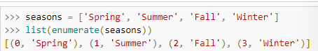
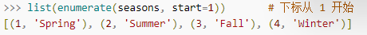
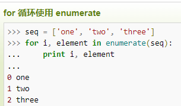
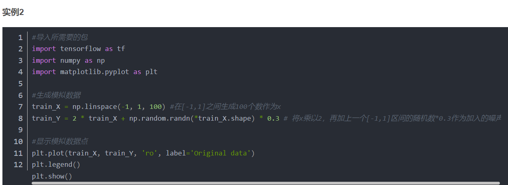

# enumerate

作用：可遍历一个数据对象，将其做何为一个索引序列，常与for连用

如果想要改变起始下标的位置的值，可以在season后面加上start=

与for连用：

# plt.plot

plt.plot(x,y,format_string,**kwargs)

x:x轴数据

y:y轴数据

x,y可以是列表或者是数组

format_string:控制曲线的格式字符串

具体可上网搜索

## 运用时需要先导入matplotlib.pyplot

