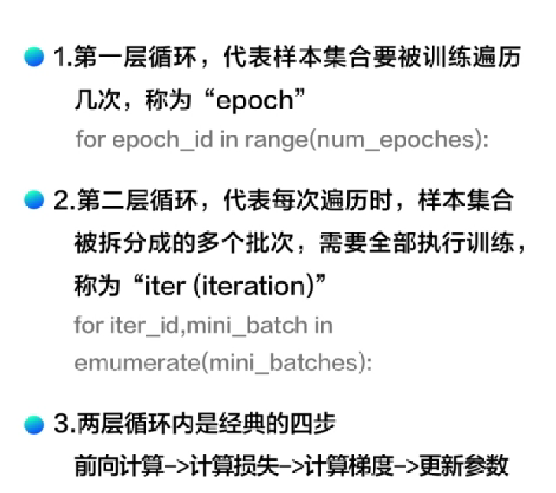

1.数据处理：

（1）数据导入 fromfile

（2）更改格式 reshape

（3）数据划分 training_data

（4）归一化处理数据 max min 

（5）获取数据 x y

2.模型设计

（1）前向计算 z

（2）计算损失 loss

（3）计算梯度 gradient

（4）更新参数 updat

（5）进行训练 train

3.模型修改

随机梯度下降模型：（两层循环)

第一层循环要获取数据

第二层循环进行运算

 

