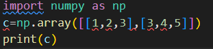
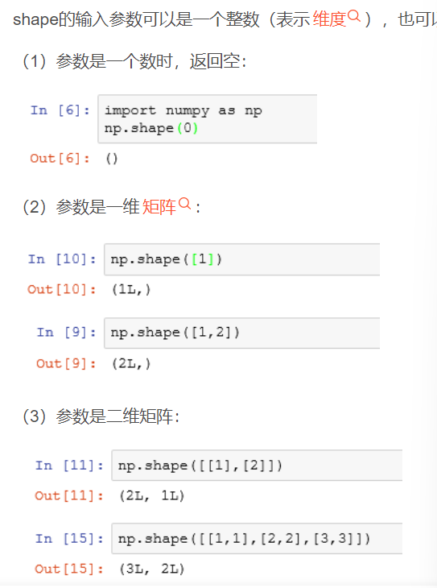
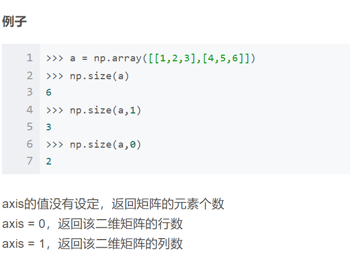
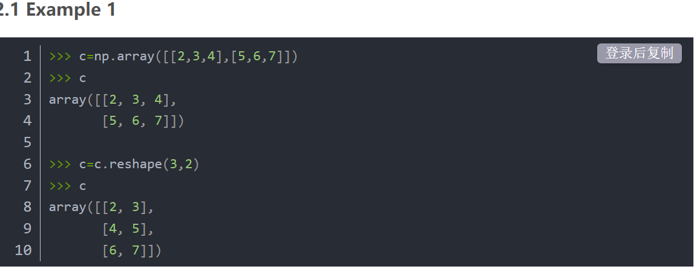
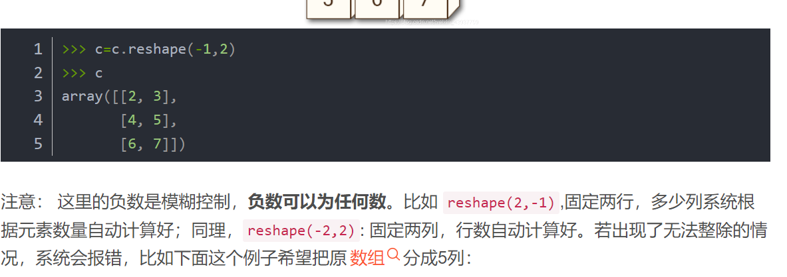
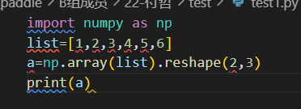

# 创建矩阵

#### 利用numpy模块，使用array函数：

# 查看矩阵：

## shape函数（作用：读取矩阵的长度）：

#### 1.用np。shape时：会返回矩阵的格式

e.g:

#### 注：实际返回是没有L

#### 2.直接用.shape：

 （1）一维矩阵时：用shape[0]：直接返回元素的个数

 （2）二维矩阵是：用shape[0]：返回矩阵的行数

                              用shape[1]：返回矩阵的列数

 （3）三维矩阵时：X.shape[0]代表包含二维数组的个数，X.shape[1]表示二维数组的行数，X.shape[2]表示二维数组的列数。

## size函数（作用：读取矩阵的个数）：

注意axis指的是（）后面的参数

## reshape函数（作用：更改矩阵的行列）

#### reshape(3,2)可以把原矩阵变为三行两列的形式

 

#### 注意：若两个参数中还有一个负数，则代表这个行或者列为不定值，将根据另一个参数输入后自动输入一个数据，自动帮你转换

#### 同时可以直接用reshape对刚刚输入的array进行格式定义

