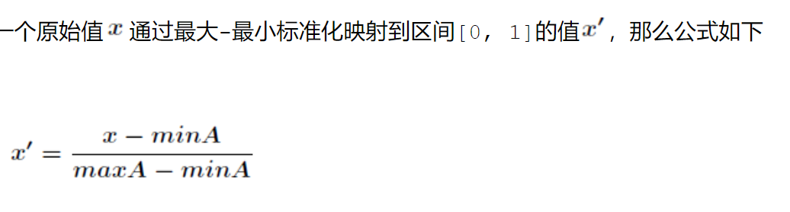
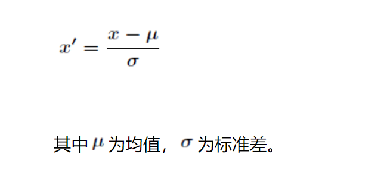
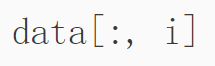
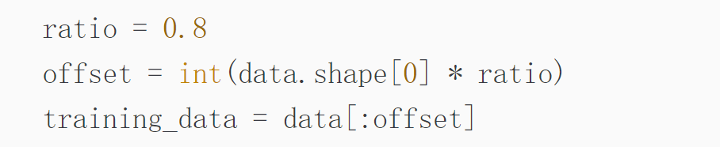

# 归一化处理

## 定义：把数据经过处理之后使之限定在一定的范围内。比如通常限制在区间[0,1]或者[-1,-2]

## 目的：减少训练时间并且避免无法收敛的问题

## 常用方法：

### 1.最大-最小标准化：

## 2.Z-score标准化：Z-score标准化是基于原始数据的均值和标准差进行的数据标准化。将属性A原始数据r通过z-score标准化成x。<u>Z-score标准化适用于属性A的最大值或者最小值未知的情况，或有超出取值范围的离散数据的情况。</u>

 

 

## 遇到的问题：

1.

### 这个指的是取一维的全部，二维到第i个

2.

#### 这里的traing_data会继承data矩阵的形式，相当于把data进行切分，取data前offset的数据