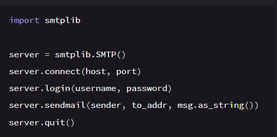
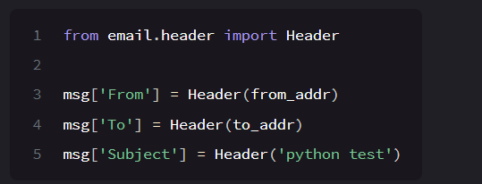
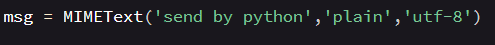

# smtp模块

### 注：

1.SMTP可能需要加_SSL，（）括号内要加服务器地址

QQ服务器地址：smtp.qq.com

2.host指的是服务器地址，port是指端口，QQ一般是465

3.username是邮箱地址，password是指授权码

4.sendmail第一个参数指发件人的邮箱，第二个是收件人的邮箱，后面as_string()是指字符串输出

5.是指关闭smtp服务

# email模块

### 注：email实际上是一个包

#### 邮件的标题：从email.header引入Header

#### 邮件的内容：

需要调用：

from email.mime.text import MIMEText

这里的‘send......'可以替换为变量

再对变量进行赋值即可发出信息

代码见aemail.py