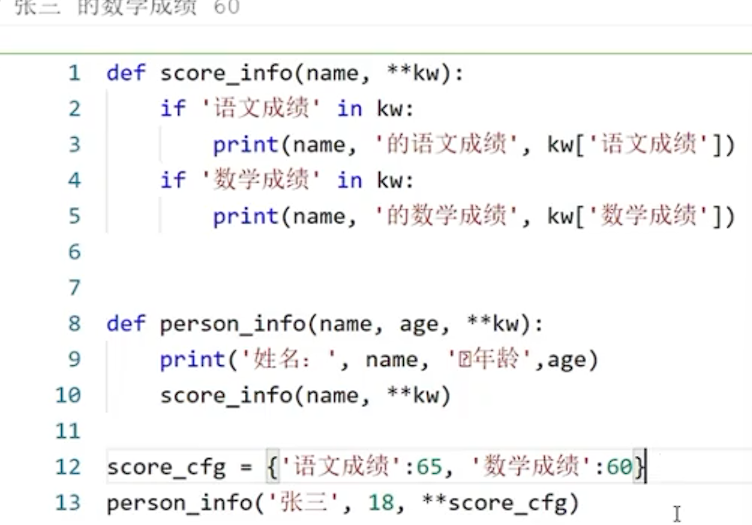

### 关键字参数

#### 形式：**kw

 

kw传进去的是字典形式

#### 用法：传递参数

##### 注意 ** 可以代表消除{ }

### 参数连用

#### 注意：运用的顺序

### lambda匿名函数

##### 例子：

### 高阶函数

#### map函数

##### 作用： map(f(x),y)      意思是把f(x)作用到y上

e.g 

##### 注意：map返回的是一个对象：

可以把它转换一下，如加一个list（）转换为列表

 

#### reduce函数

##### 作用：

 

#### sorted函数

##### 1.一般是从小到大排序，如果想从大到小可以在后面加reverse=Ture

##### 2.与key联用形成高阶函数

##### 3.实战：

### 装饰器

 

### 闭包